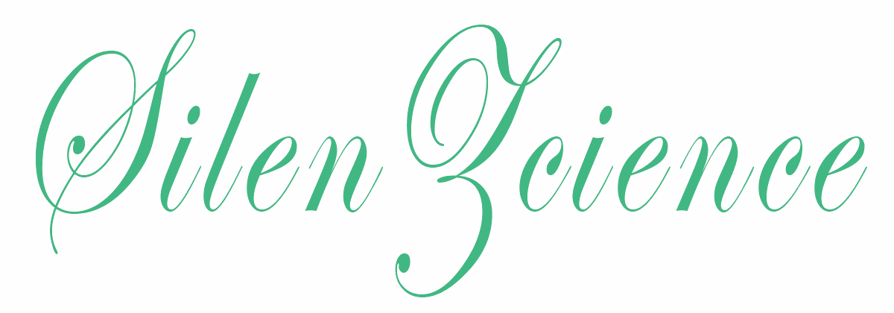

<!-- Profile Views -->

# [&#x200B;](#) 💫 Hi there, I'm Silas

<!-- Username -->

	
		

<!-- Messages -->

	 

<!-- Tech Stack -->

<b>My Tech Stack</b>

 

![CopyPaste](https://img.shields.io/badge/strg%20c%20%26%20strg%20v-9F22B5.svg?style=for-the-badge&logo=data:image/svg+xml;base64,PCFET0NUWVBFIHN2ZyBQVUJMSUMgIi0vL1czQy8vRFREIFNWRyAxLjEvL0VOIiAiaHR0cDovL3d3dy53My5vcmcvR3JhcGhpY3MvU1ZHLzEuMS9EVEQvc3ZnMTEuZHRkIj4KDTwhLS0gVXBsb2FkZWQgdG86IFNWRyBSZXBvLCB3d3cuc3ZncmVwby5jb20sIFRyYW5zZm9ybWVkIGJ5OiBTVkcgUmVwbyBNaXhlciBUb29scyAtLT4KPHN2ZyBmaWxsPSIjRkZGRkZGIiB3aWR0aD0iODAwcHgiIGhlaWdodD0iODAwcHgiIHZpZXdCb3g9IjAgMCAzMiAzMiIgdmVyc2lvbj0iMS4xIiB4bWxucz0iaHR0cDovL3d3dy53My5vcmcvMjAwMC9zdmciIHN0cm9rZT0iI0ZGRkZGRiI+Cg08ZyBpZD0iU1ZHUmVwb19iZ0NhcnJpZXIiIHN0cm9rZS13aWR0aD0iMCIvPgoNPGcgaWQ9IlNWR1JlcG9fdHJhY2VyQ2FycmllciIgc3Ryb2tlLWxpbmVjYXA9InJvdW5kIiBzdHJva2UtbGluZWpvaW49InJvdW5kIi8+Cg08ZyBpZD0iU1ZHUmVwb19pY29uQ2FycmllciI+IDx0aXRsZT5jbGlwYm9hcmQxPC90aXRsZT4gPHBhdGggZD0iTTcuOTAzIDcuMDIzYzAgMC41NSAwIDEuOTkzIDAgMS45OTNoMTQuMDE0YzAgMCAwLTEuNDQzIDAtMS45OTNzLTAuNDQ1LTAuOTk3LTAuOTk2LTAuOTk3aC0yLjk5YzAgMCAwLjAzNC0xLjEzOCAwLjAzNC0yLjg4MiAwLTEuNjE5LTEuNDA0LTMuMDk4LTMuMDg2LTMuMDk4cy0yLjk3OCAxLjQwNi0yLjk3OCAzLjA4OWMwIDEuNjE5LTAuMDEyIDIuODkxLTAuMDEyIDIuODkxaC0yLjk4OWMtMC41NTEgMC0wLjk5NyAwLjQ0Ni0wLjk5NyAwLjk5N3pNMTQuODc5IDMuMDM3YzAuNTUgMCAwLjk5NyAwLjQ0NiAwLjk5NyAwLjk5NiAwIDAuNTUxLTAuNDQ3IDAuOTk3LTAuOTk3IDAuOTk3cy0wLjk5Ny0wLjQ0Ni0wLjk5Ny0wLjk5N2MwLTAuNTUgMC40NDctMC45OTYgMC45OTctMC45OTZ6TTIzLjkxMSA2LjAyNnY5LjkwMWMwIDAgMC44Ni0wLjk0OSAxLjk5Mi0xLjQwNHYtOS40OTNjMC0xLjEwMS0wLjk1NS0xLjk5My0yLjA1NS0xLjk5M2gtNC45MjF2MS45OTNoMy45ODZjMC41NTEgMCAwLjk5OCAwLjQ0NiAwLjk5OCAwLjk5NnpNMTIuODIzIDMwLjAwNmgtNS45MTdjLTAuNTUgMC0wLjk5Ni0wLjQ0NS0wLjk5Ni0wLjk5NnYtMjIuOTg0YzAtMC41NSAwLjQ0Ni0wLjk5NiAwLjk5Ni0wLjk5Nmg0LjA0OXYtMS45OTNoLTUuMDQ1Yy0xLjEwMSAwLTEuOTkzIDAuODkzLTEuOTkzIDEuOTkzdjI0Ljk3NmMwIDEuMTAxIDAuODkyIDEuOTk0IDEuOTkzIDEuOTk0aDkuMDgxYy0wLjM5LTAuNjU4LTEuMDg3LTEuNDE4LTIuMTY4LTEuOTk0ek0yMy45MTEgMjkuMDEwYzAgMC41NTEtMC40NDcgMC45OTYtMC45OTcgMC45OTZoLTIuNzI5Yy0wLjUwMiAwLjY3Mi0wLjk3NSAxLjM0LTEuNDEgMS45OTRoNS4wNzRjMS4xIDAgMi4wNTUtMC44OTMgMi4wNTUtMS45OTR2LTYuMTI5Yy0wLjY2IDAuNTQzLTEuMzI4IDEuMTU2LTEuOTkyIDEuODN2My4zMDN6TTI4LjA4MyAyMC45MjZjLTEuMTIzLTIuNDk2LTAuNDgtNC41MjMtMC4zMi02Ljg2My02LjU3OSAzLjI3NS0xMC43NTEgMTMuMTAzLTEwLjc1MSAxMy4xMDNsLTIuNTY3LTQuODM2LTUuMjk1IDMuMTE5YzIuMjQ3IDAuNzc5IDUuNDU2IDMuMjc1IDguMTg0IDYuNTUxIDEuOTI0LTMuNDMyIDcuODYxLTEwLjQ0OSAxMC43NDktMTEuMDc0eiIvPiA8L2c+Cg08L3N2Zz4=)

<!-- Statistic Details -->

<b>Github Stats and Activity </b>

<h2>
	<a href="#">&#x200B;</a>
	
	Github Stats and Activity
</h2>

🔥 Github Streak Stats

<h2><a href="#">&#x200B;</a>🔥 Github Streak Stats</h2>
<!-- Github Streak -->

	
	

💻 GitHub Profile Stats

<h2><a href="#">&#x200B;</a>💻 GitHub Profile Stats</h2>
<!-- Github Stats -->
<!-- language Stats -->

	<!-- Dark Mode Images -->
	
	<!-- Light Mode Images -->
	

🍻 GitHub Contribution Stats

<h2><a href="#">&#x200B;</a>🍻 GitHub Contribution Stats</h2>
<!-- Contribution Graph -->

	<!-- Dark Mode Images -->
	
	<!-- Light Mode Images -->
	

⚡ Recent GitHub Activity

  
<!--START_SECTION:activity-->
1. 🚀 Published release [V1.9.2 2024.10.21](https://github.com/SilenZcience/cat_win/releases/tag/v1.9.2) in [SilenZcience/cat_win](https://github.com/SilenZcience/cat_win)
2. 🚀 Published release [V1.9.1 2024.10.10](https://github.com/SilenZcience/cat_win/releases/tag/v1.9.1) in [SilenZcience/cat_win](https://github.com/SilenZcience/cat_win)
3. 🚀 Published release [V1.9.0 2024.09.05](https://github.com/SilenZcience/cat_win/releases/tag/v1.9.0) in [SilenZcience/cat_win](https://github.com/SilenZcience/cat_win)
4. 🗣 Commented on [#4](https://github.com/shawwn/supports-color-python/issues/4#issuecomment-2294508291) in [shawwn/supports-color-python](https://github.com/shawwn/supports-color-python)
5. 💪 Opened PR [#6](https://github.com/shawwn/supports-color-python/pull/6) in [shawwn/supports-color-python](https://github.com/shawwn/supports-color-python)
<!--END_SECTION:activity-->

- - - -
<!-- ## [&#x200B;](#) Game of Life <a href="https://github.com/SilenZcience/GameOfLifeAction/blob/main/GameOfLife/GameOfLife.py">(click to see Source)</a> -->
<!-- GameOfLife -->
<!-- Dark Mode Image -->

<!-- Light Mode Image -->

