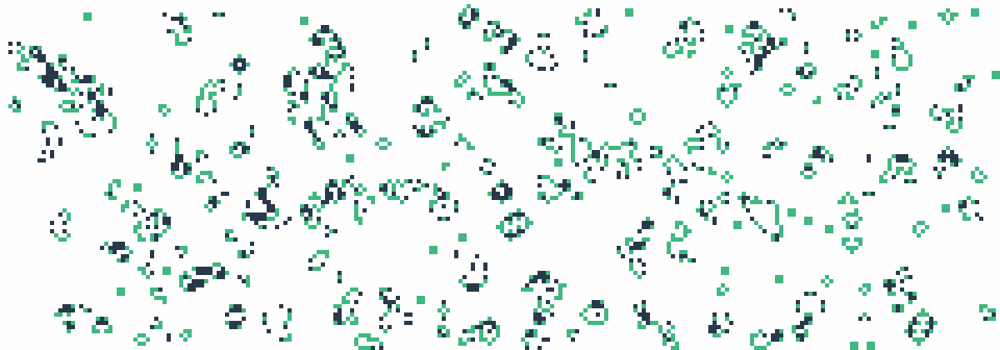

# Hi there, I'm Silas

  <picture>
    <source align="right" media="(prefers-color-scheme: dark)" srcset="https://komarev.com/ghpvc/?username=SilenZcience&color=d83a7d&style=for-the-badge">
    
  </picture>
   

 
 

#  Statistics

 

    <!-- <a href=""> -->
	
	
	<picture>
		<source width="49.2%" media="(prefers-color-scheme: dark)" srcset="https://github-readme-streak-stats.herokuapp.com/?user=SilenZcience&theme=radical&hide_border=true">
		
	</picture>
    <!-- </a> -->

    
	

	
	
  
  <a href="https://github.com/SilenZcience/SilenZcience/blame/main/CSS_UsernameDark.svg">
    <picture>
      <source width="43.2%" align="right" media="(prefers-color-scheme: dark)" srcset="./CSS_UsernameDark.svg">
      
    </picture>
  </a>

 
 
 
 
 
 

- - - -
##   Game of Life <a href="https://github.com/SilenZcience/GameOfLifeAction/blob/main/GameOfLife/GameOfLife.py">(click to see Source)</a>

	<a href="https://github.com/SilenZcience/GameOfLifeAction/blob/main/GameOfLife/GameOfLife.py">
		<picture>
			<source width="98.6%" media="(prefers-color-scheme: dark)" srcset="./GameOfLife/GameOfLifeDark.png">
			
		</picture>
		<picture>
			<source width="98.6%" media="(prefers-color-scheme: dark)" srcset="./GameOfLife/IterationDark.svg">
			
		</picture>
	</a>

- - - -

  
:zap: Recent GitHub Activity

  
<!--START_SECTION:activity-->
1. 🎉 Merged PR [#1](https://github.com/SilenZcience/cmdtrix/pull/1) in [SilenZcience/cmdtrix](https://github.com/SilenZcience/cmdtrix)
2. 🎉 Merged PR [#1](https://github.com/SilenZcience/GameOfLifeAction/pull/1) in [SilenZcience/GameOfLifeAction](https://github.com/SilenZcience/GameOfLifeAction)
3. ❌ Reopened PR [#1](https://github.com/SilenZcience/GameOfLifeAction/pull/1) in [SilenZcience/GameOfLifeAction](https://github.com/SilenZcience/GameOfLifeAction)
4. ❌ Closed PR [#1](https://github.com/SilenZcience/GameOfLifeAction/pull/1) in [SilenZcience/GameOfLifeAction](https://github.com/SilenZcience/GameOfLifeAction)
5. 🗣 Commented on [#1](https://github.com/SilenZcience/GameOfLifeAction/issues/1) in [SilenZcience/GameOfLifeAction](https://github.com/SilenZcience/GameOfLifeAction)
<!--END_SECTION:activity-->

